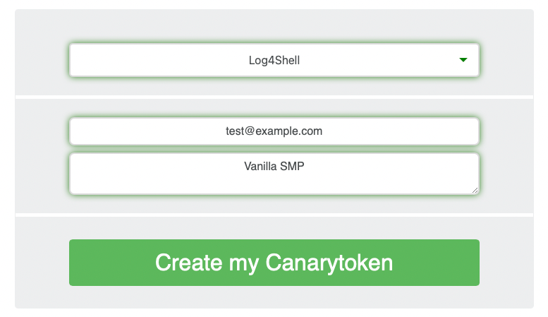
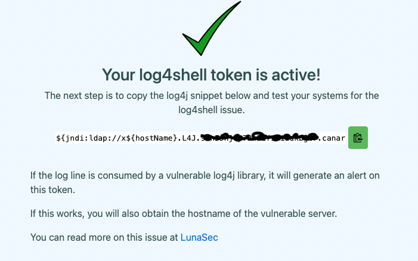
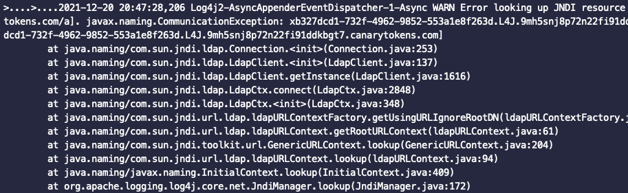
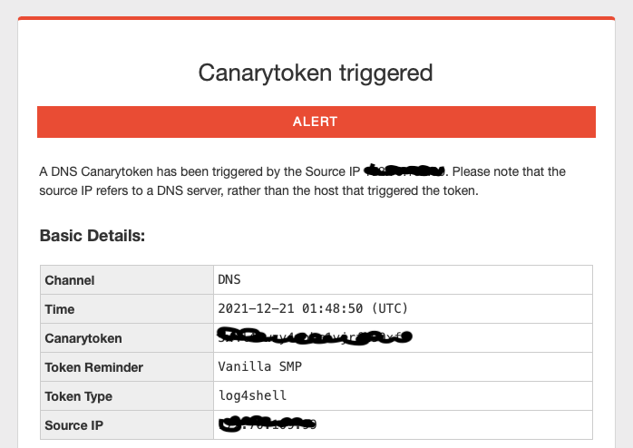

If you are reading this post you are probably aware of the log4shell vulnerability that was discovered a little over a week ago. This allows any java application using the log4j logging library to execute remote code from an attacker. Paper, Forge, and Mojang were quick to patch the servers against the threat.

If you are worried that your server might be vulnerable the first thing you should do is download the latest version of whatever jar you use. If you want to validate the patch worked then you can follow the rest of this guide.

# Canary Tokens

Canary tokens is a service that allows you to check for many common exploits, in this case Log4Shell. We will use their public service to run our check. If you are worried about security you can deploy your own instance using their Github repo but that will not be covered here.

When you load the website you want to select Log4Shell from the list of vulnerabilities, provide your email address, and give a note that you can easily identify. If you have multiple servers you are testing I would give each of them a unique note.

After clicking create you will be given your canary token. Copy the token and head to your MC server to run the test.

# Testing your server

In your server's console run the command say PASTE_TOKEN_HERE. If nothing happens but the server echos it back and you don't get an email then you are all set! Your server is patched against Log4Shell!

However if your server freezes, doesn't echo the line, or starts spitting out tons of errors like this one, your server is still vulnerable and you need to make sure you updated or consult with the maker of your server jar.

You will also get an email that looks something like this.

I hope this helps anyone who is concerned about this vulnerability and I urge everyone to take this seriously.
