In this tutorial we will be going over how Lens Studio works, how to navigate Lens Studio, and how to modify one of the example scenes to have a tennis ball with a shadow that you can move.

# Requirements:
- Snapchat Account
- Windows 10 / MacOS 10.10+

You do not need a phone as Lens Studio has a simulator, but to get the full experience I would recommend having one.

# Lets Get Started!

The first step is to download Lens Studio from Snapchat's Website, you can use the link below.

[Lens Studio by Snap Inc.](https://lensstudio.snapchat.com)

You will need to sign into your Snapchat account and then agree to the terms of service. You can then download and install Lens Studio for your OS.

It is important that you own or have permission to use the assets in your lens if you plan to publish it. You can still send what you make to friends without publishing, but you will be the only one who can use it.

The first time you open Lens Studio you will have a window that looks like this:

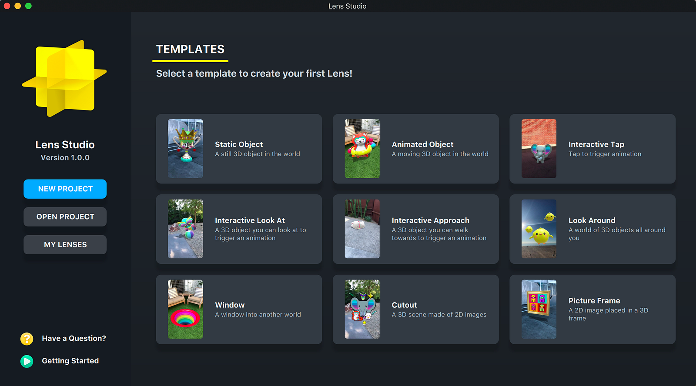

Within this home menu you have several options:
- New Project - Creates a blank Lens with nothing except a camera and lights.
- Open Project - Opens a project you have already created
- My Lenses - Lets you browse Lenses that you have published / are in review.
- Templates - These are examples of various things you can do in Lens Studio, I would recommend always starting with one of these and modifying it to what you need.

Lets choose the Static Object Template

# The Interface

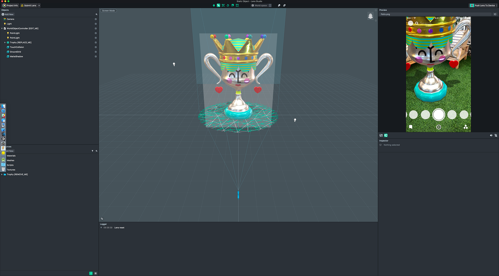

When you first open Lens Studio the interface can be a little overwhelming. Lets walk through each section and explain what it is and how it works.

## The Menu Bar:

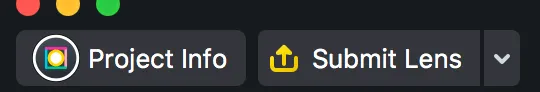
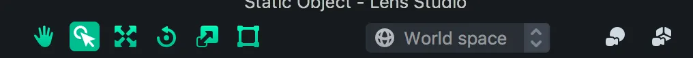
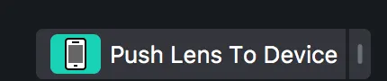

The top menu bar has three sections:

- Project Information Section - In this section you can edit your projects information, such as name, logo, and function. You can also submit your Lens to be published, but don't do this until you are completely ready as you can't edit your Lens until it goes through submission. If you click the arrow you can also access the My Lenses menu we talked about earlier.
- Tools Menu - In this section you have access to the tools you can use to manipulate the scene. We will go over each of these tools more later.
- Testing - The last section allows you to test your Lens. The first time you open Lens Studio if you click this button it will ask you to pair to your device, once paired you can just click the button and test your Lens on your device.

## Objects Panel:

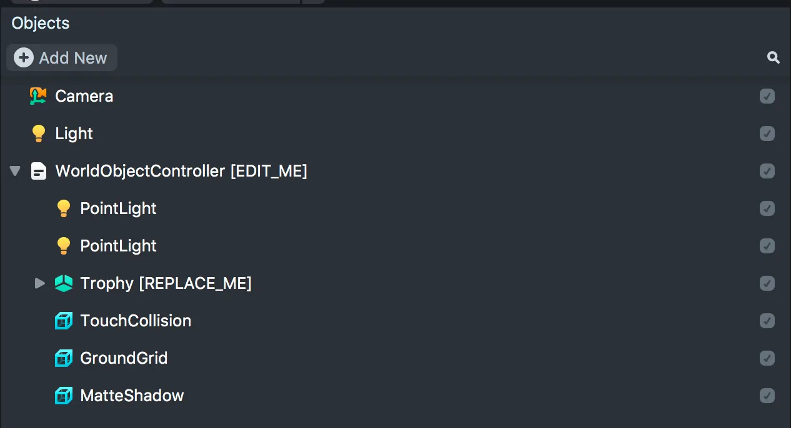

The Objects Panel shows you everything that is currently in your scene, and add new objects. If you click the Add New button you get a menu to add any of the available objects to your scene.

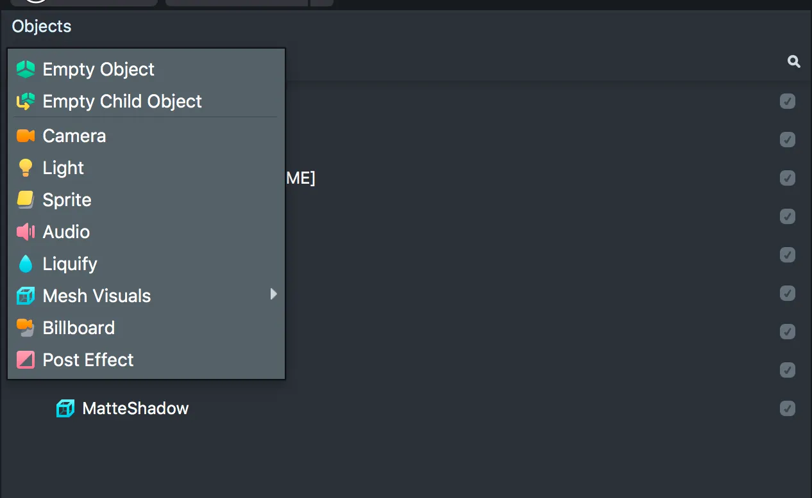

## Resources Panel:

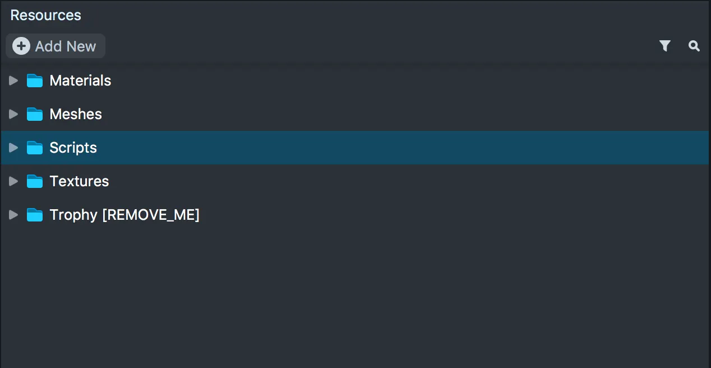

This panel is a file explorer for your Lens project. Its where you can put images, sounds, and models that you plan to use. This view also has an Add New button, but it has a different layout and some new options.

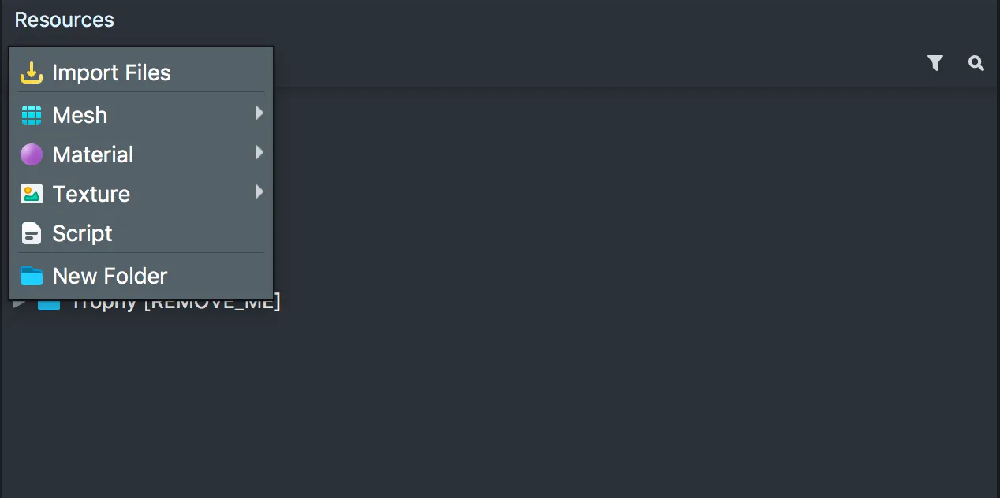

The two most important of the new options are the Import Files button, which allows you to import 3D Models, Images, and Sounds. And the Script button, which allows you to create scripts to add interaction to your Lens.
We won't be covering Scripts in this tutorial, but in the next one we will be using them to play a sound.

## Scene View:

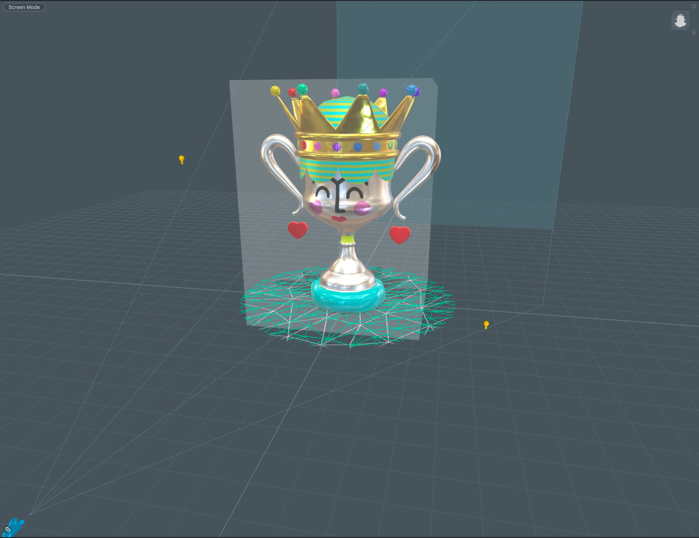

The Scene View is the biggest view in Lens Studio, this is where you edit and move objects using the tools from the Tool Bar. The scene is a 3D represenation of what will be projected when you run your Lens. With the template we chose there is a trophy and a ground mesh.

To navigate the Scene view you use:
- Left Mouse Button- Selects Objects for Editing. Must have the Selection Tool, either select it from the Tool Bar or tap Q.
- Right Mouse Button - Rotates your Scene
- Middle Mouse Button / Pan Tool - Pans your Scene
- Scrolling - Zooms in and Out

When you select an object in the Scene view you can edit it in a few ways:
Transform - Move the object in any of the axis. Select the Transform Tool, or tap W
Rotate - Rotate the object in any of the axis. Select the Rotation Tool, or tap E
Scale - Scale the object in any of the axis. Select the Scale Tool, or tap R.

## Logger:

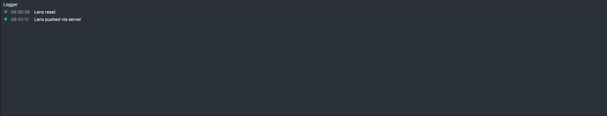

The Logger is a console, when using scripts you can print information here, or if an error occurs it will appear here.

## Preview:

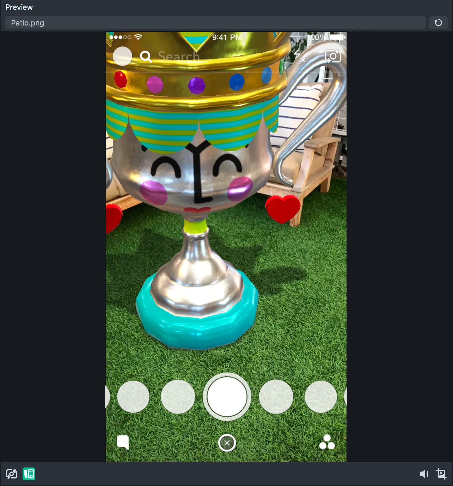

The Preview lets you do exactly as it says, Preview! It lets you see what and how your Lens will react within Snapchat. Anything you could do on your phone you could do here. It has a few options to configure it how you want.

If you click the top text where it by default says Patio.png, you can choose a new background, either as a image or video, for testing your Lens. There is also a refresh button in the top right to restart the preview.

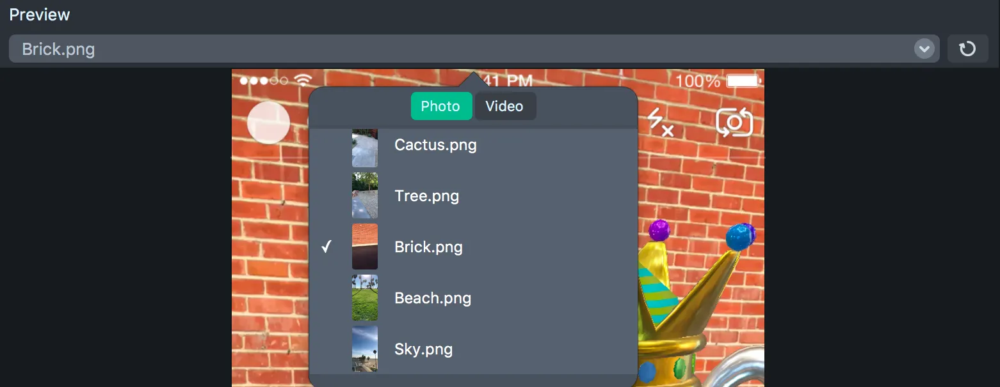

On the bottom of the preview there is a row of buttons that let you do various things:

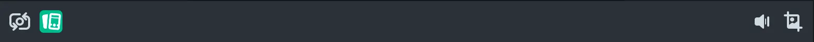

- Switch Camera — Switches the Preview to be the opposite camera, there are no Lens features for the front facing camera yet.
- Toggle UI — This turns the Snapchat UI on an off, its good if you want to see your Lens a little better, but it is important for placing objects.
- Toggle Sound — If your Lens plays Audio you might want to mute it to test other features.
- Take a Screenshot — Save a image of what the preview sees, to send to friends or maybe other people you are working with.

## Inspector

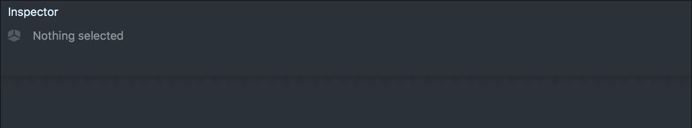

The Inspector is where you do most of your editing. Depending on what you have selected this will change. If you have a object selected you will see all of its information and whats attached to it. If you have a script selected you will get a basic editor to program your script. This will be one of your most used menu items.

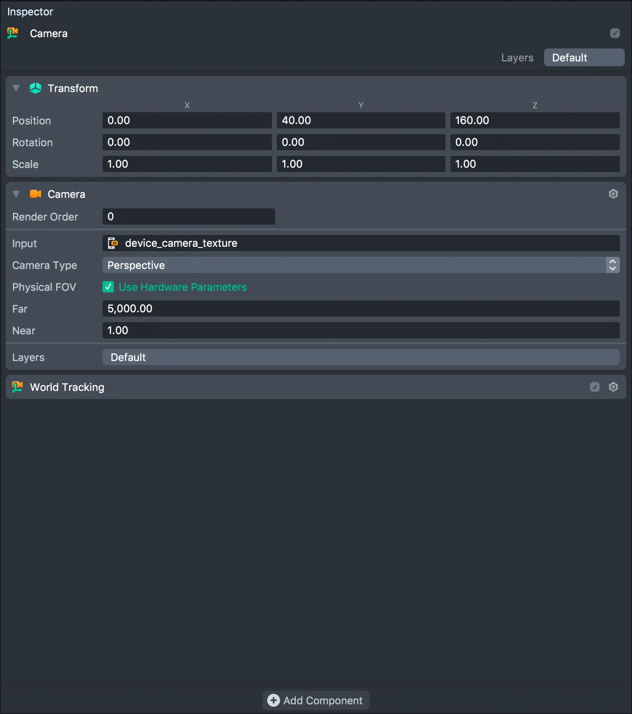

## Interface Wrap Up:

You should now be familiar with the location of everything in Lens Studio. As we walk through the next steps of making your own Lens I will go more in depth about how each tool works and when to use what.

...

To be continued