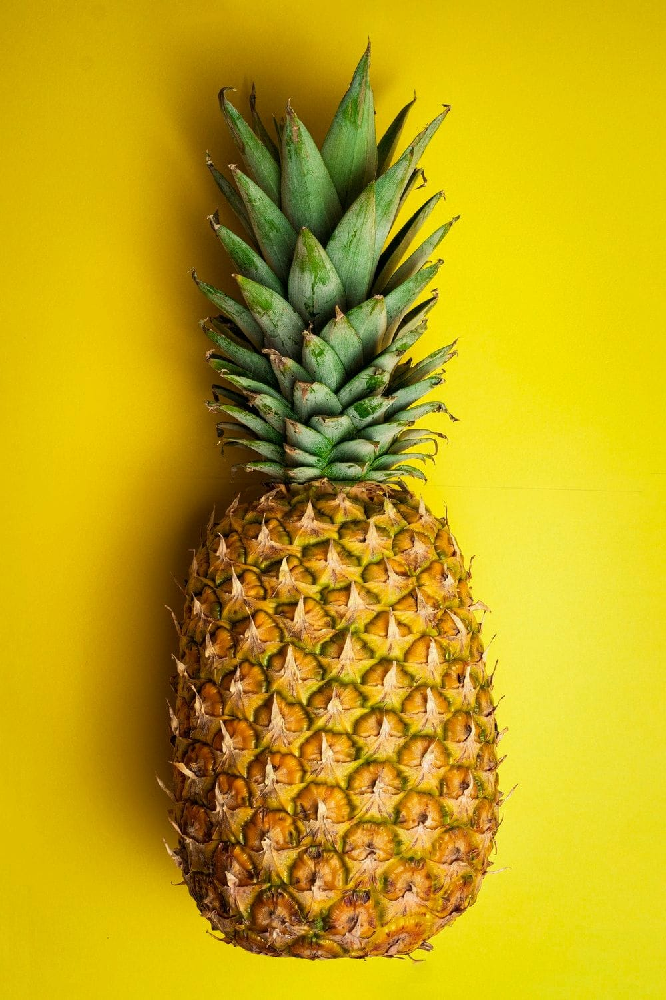
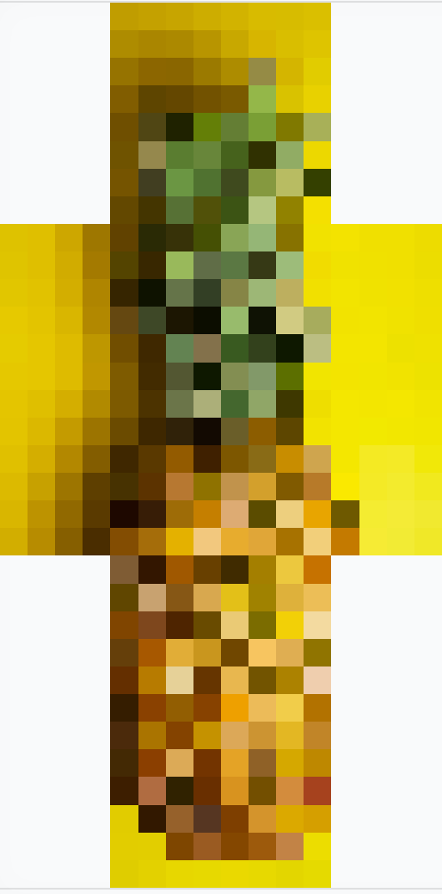
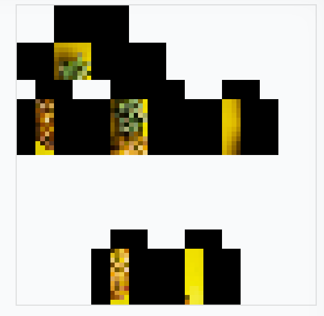
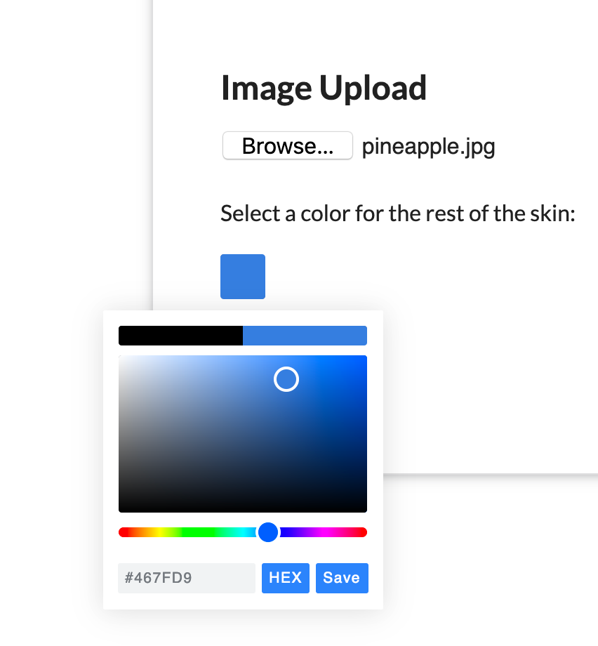

I have been running a Minecraft server for a streamer named Geof for a little over a year now and during a celebration stream for his Twitch partnership I thought it would be funny to put his face on a Minecraft Skin. I went to find a tool online to make this easy for me and I couldn't find one. I ended up building the skin in Photoshop, but from then on I thought it would be cool to have a website that could make these skins for you.

Fast forward a few months and on a Discord discussion I mentioned this idea and a couple people liked it. I started writing a Python app using OpenCV as this is what I am most familiar with. From there I built out the resizing method for providing input images, and then the cropping system. This allowed me to take any image and scale it to look like the front of a Minecraft skin.

Original Image and then the cropped and resized front of a Minecraft skinThis was the easy part, simple resizing and cropping is not difficult in OpenCV. Now I got to the harder part, MC skins are wrapped around the player model. So instead of looking like the above image, the raw texture files look like this:

My method of translation was to make a new empty file with the resolution of a full Minecraft skin and then cut from the cropped skin file to place each element in the correct spot. For the rest of the skin it was just filled in with black. This resulting image was then exported as a .png and can be used for a Minecraft skin.

I could stop there, but it needed to work online. I am familiar with Flask, a Python library for making web servers, but I am much more comfortable working with NodeJS and Express. My solution was to wrap the Python app in a way that it could be called by the NodeJS app. This worked pretty well and once the Python app was setup to take variables it was as simple as calling:

`const python = spawn('python', ['main.py', newName, color]);`

You may notice that you can feed in a color variable, this was also an improvement I made when building the web version. Instead of just a plain black background I added a color picker to let users choose what skin they wanted to use.

This lets people blend their background into the front of the skin, or just add a personal touch.

In the end the resulting workflow is as follows:

1. User uploads a png or jpeg image
2. A color for the background is selected
3. The image is uploaded to the server
4. The server starts a new instance of the Python app providing the image and color
5. The Python app does the cropping and moving needed to build the final skin and builds two images, the preview and the full skin
6. These images are given a random ID and sent back to the user. From here they can download them

In the future I need to start deleting these images just to not take up too much space but as of right now the full app is up and running.

You can try it out yourself at [skins.tgb.gg](https://skins.tgb.gg)

Source code is on [Github](https://github.com/tgb20/ImageToSkin?ref=tgb.gg)
